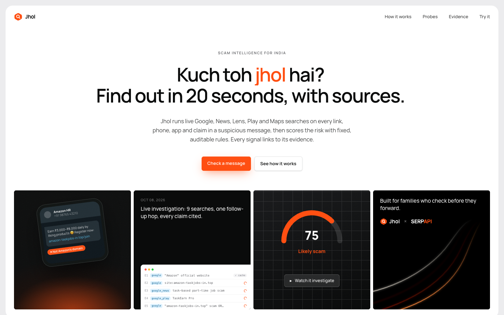
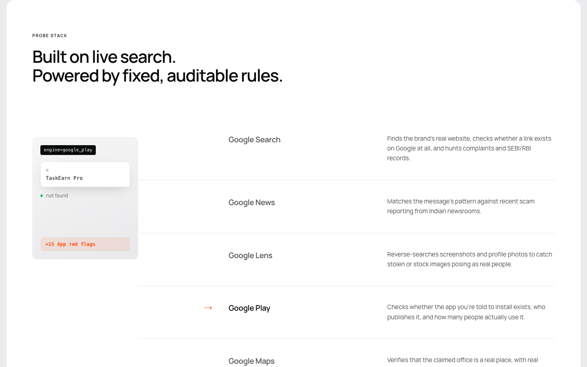
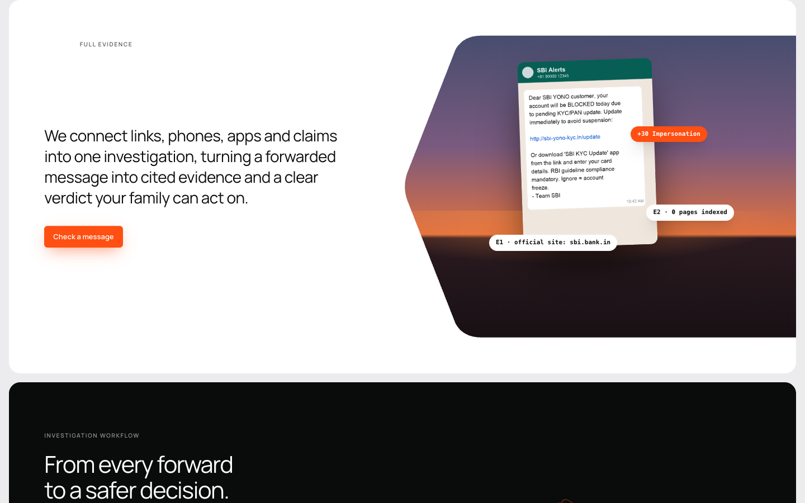
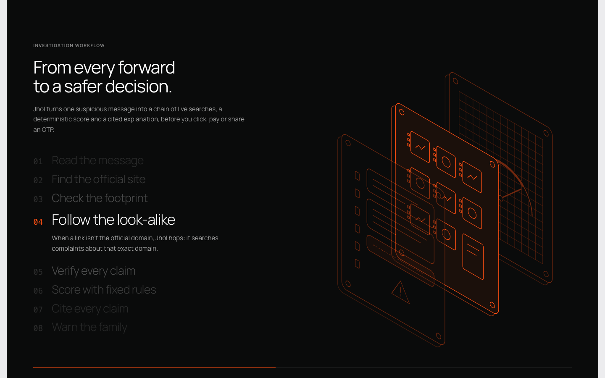
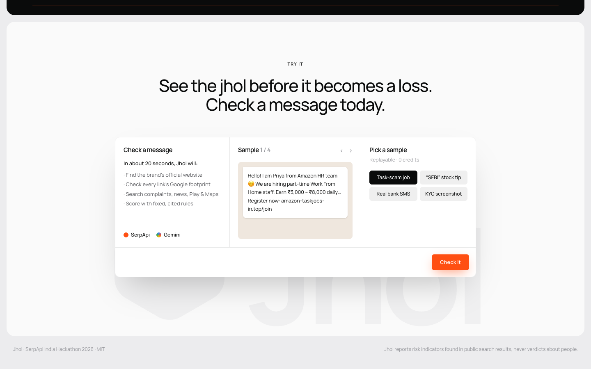
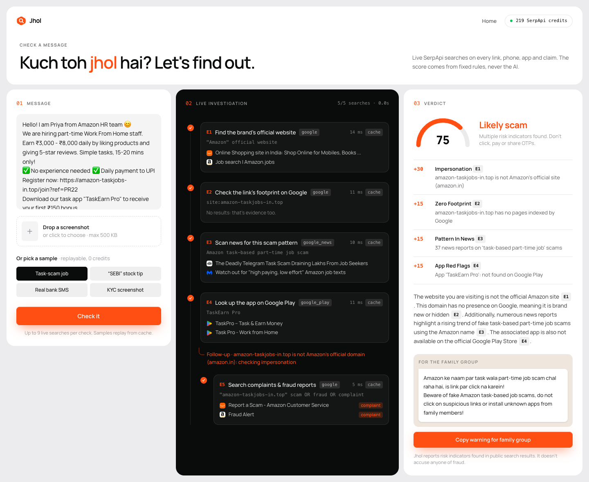
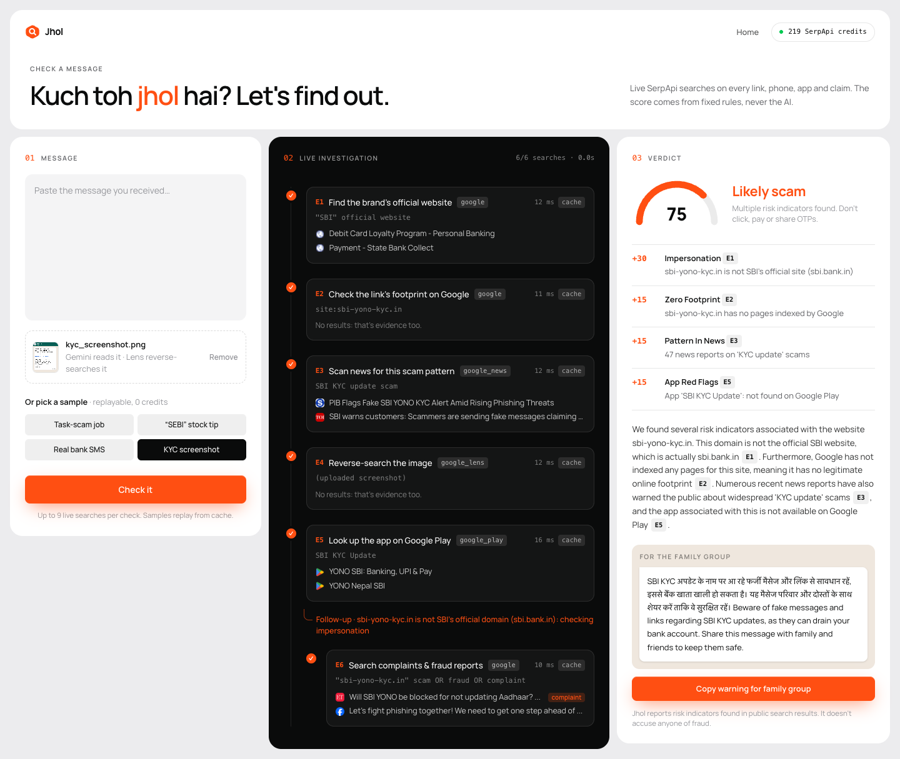
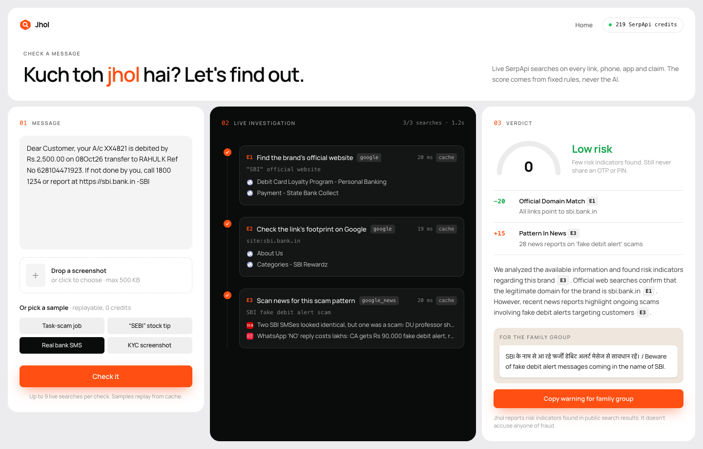
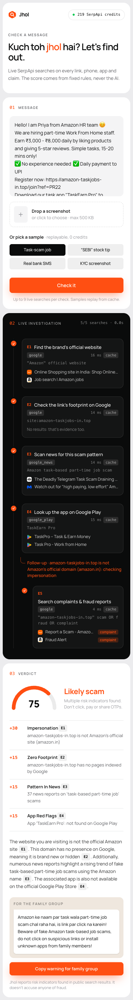
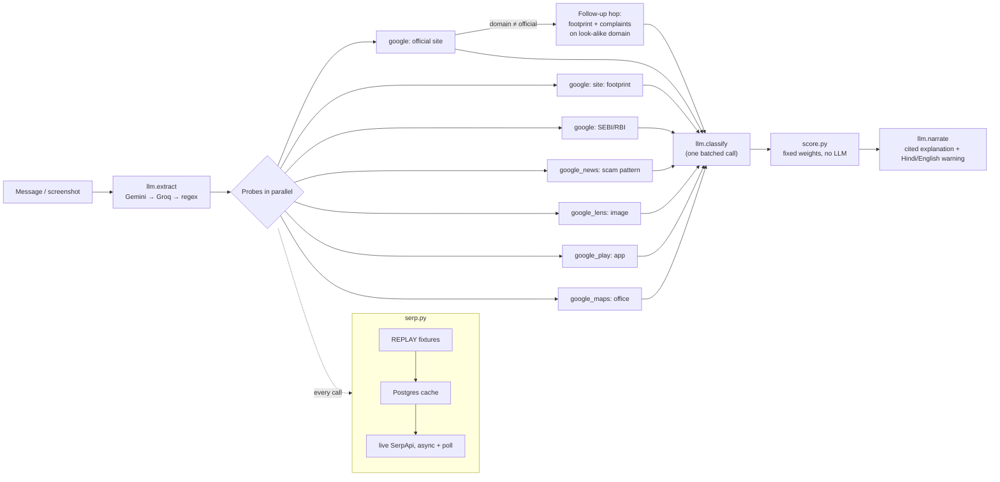

# Jhol

> *"Kuch toh jhol hai"*: something's fishy.

Jhol is an evidence-based scam checker for Indian users. Paste a suspicious WhatsApp/SMS message (task-based job
offer, "SEBI registered" stock tip, KYC alert, loan app) or drop a screenshot. Jhol pulls out the brands, links,
phones, apps and claims in it, runs **targeted live Google searches through SerpApi** against each one, and gives
a **deterministic 0–100 risk score**. Every signal links to the search result behind it.

The LLM never sets the score. It only extracts entities, labels snippets and writes the explanation.

Built for the SerpApi India Hackathon 2026.



## Project brief

| | |
|---|---|
| **Who it's for** | Indian families who receive forwarded job offers, stock tips, KYC alerts and loan-app links on WhatsApp/SMS, and the one relative everyone asks "is this real?" |
| **What you give it** | Pasted message text, or a screenshot (Gemini reads the text out of the image). |
| **What it does** | Pulls out brands, links, phones, UPI IDs, apps, regulator claims and addresses. It then runs up to 9 live searches across **5 SerpApi engines**: Google, Google News, Google Lens, Google Play and Google Maps. When a link isn't the brand's real domain, it makes a **follow-up hop** to search complaints about that look-alike. |
| **What you get** | A **0–100 risk score** from 11 fixed, weighted rules; each signal cites the search behind it (`[E1]`, `[E2]` …); a plain-English explanation; and a **Hindi + English warning** ready to paste into the family group. |
| **Why trust it** | The score is deterministic and auditable. The AI only extracts entities, labels snippets and writes the explanation. Invented citations are stripped. A failed search is marked *inconclusive* and never adds risk. |
| **Cost to run** | ₹0. Built on the SerpApi free plan (250 searches/month) with a Postgres cache, replay fixtures, and async search + free archive polling, so no credit is wasted on timeouts. |
| **Try it without keys** | `REPLAY=1` serves all four samples from saved fixtures, with no network calls and no API keys. |

**Results on the bundled samples** (all replayable):

| Sample | Score | Verdict | Signals that fired |
|---|---|---|---|
| "Amazon HR" task-scam job offer | **75** | Likely scam | Impersonation +30, Zero footprint +15, Pattern in news +15, App red flags +15 |
| "SEBI registered" stock tip | **75** | Likely scam | Regulator claim unverified +20, Zero footprint +15, Pattern in news +15, App red flags +15, Ghost office +10 |
| SBI KYC scam (screenshot) | **75** | Likely scam | Impersonation +30, Zero footprint +15, Pattern in news +15, App red flags +15 |
| Real SBI debit SMS (control) | **0** | Low risk | Official domain match −20, Pattern in news +15 |

## Screenshots

### The portal

| Landing: hero | Landing: probe stack |
|---|---|
|  |  |
| **Landing: evidence** | **Landing: scroll-driven investigation workflow** |
|  |  |



### Outputs: the checker (`/check`)

Each check fills three panels: **01 Message**, **02 Live investigation** (every SerpApi search with its engine,
exact query, source badge and top results) and **03 Verdict** (score, signals with citations, explanation and the
family-group warning).

**Task-scam job offer: 75, likely scam.** The official-site search finds `amazon.in`, so Jhol makes the follow-up
hop to check the look-alike domain.



**"SEBI registered" stock tip: 75, likely scam.** No SEBI/RBI page names the company, the app isn't on Play, and
there's no business at the claimed Dalal Street office.


**KYC scam screenshot: 75, likely scam.** Gemini reads the image, Lens reverse-searches it, and the look-alike
`sbi-yono-kyc.in` is flagged against `sbi.bank.in`.



**Real SBI debit SMS (control): 0, low risk.** The only link is SBI's official domain, which outweighs the
general news about fake debit alerts.



<details>
<summary><b>Mobile view</b></summary>



</details>

### Outputs: terminal

The same pipeline runs from the CLI. This is real output with `REPLAY=1`, so no keys or network are used:

```text
$ REPLAY=1 python manage.py investigate ../examples/task_scam.txt
  ✓ E1 official_domain  replay  {"brand": "Amazon", "official_domain": "amazon.in"}
{"type": "followup", "reason": "amazon-taskjobs-in.top is not Amazon's official domain (amazon.in): checking impersonation"}
  ✓ E4 play_app         replay  {"app": "TaskEarn Pro", "found": false}
  ✓ E3 news_pattern     replay  {"pattern": "task-based part-time job", "articles": 37}
  ✓ E2 domain_footprint replay  {"domain": "amazon-taskjobs-in.top", "indexed": 0}
  ✓ E5 complaints       replay  {"target": "amazon-taskjobs-in.top"}
    E5 [complaint] Report a Scam - Amazon Customer Service
    E5 [complaint] Fraud Alert
    …
{"type": "signal", "code": "IMPERSONATION", "weight": 30, "evidence_ids": ["E1"], "detail": "amazon-taskjobs-in.top is not Amazon's official site (amazon.in)"}
{"type": "signal", "code": "ZERO_FOOTPRINT", "weight": 15, "evidence_ids": ["E2"], "detail": "amazon-taskjobs-in.top has no pages indexed by Google"}
{"type": "signal", "code": "PATTERN_IN_NEWS", "weight": 15, "evidence_ids": ["E3"], "detail": "37 news reports on 'task-based part-time job' scams"}
{"type": "signal", "code": "APP_RED_FLAGS", "weight": 15, "evidence_ids": ["E4"], "detail": "App 'TaskEarn Pro': not found on Google Play"}
{"type": "score", "score": 75, "band": "likely_scam"}
{"type": "narrative", "text": "The website you are visiting is not the official Amazon site [E1]. This domain has no presence on Google, …"}
```

This run also shows the guardrail in action. The LLM labelled 8 results under E5 as "complaints", but they're
generic Amazon scam pages that never name `amazon-taskjobs-in.top`. The deterministic `mentions()` check rejects
them, so `COMPLAINTS_FOUND` (+25) doesn't fire.

The streaming API returns the same events as NDJSON:

```bash
curl -N -F text=@examples/task_scam.txt localhost:8000/api/investigate
```

## The problem

Indians lost thousands of crores to online fraud last year, mostly through messages that *look* legitimate: an
"Amazon HR" job, a "SEBI registered" advisor, an "SBI KYC" link. The checks that expose them are simple but
tedious: is this the brand's real domain? Does the site exist on Google at all? Is the advisor actually on SEBI's
site? Is the app on the Play Store? Is there an office at that address? Jhol runs all of them in parallel in about
20 seconds and shows its work.

## Architecture



The backend streams NDJSON events (`entities`, `probe_start`, `probe_done`, `followup`, `signal`, `score`,
`narrative`, `credits`, `done`), so the UI fills in each search card as it finishes.

## How SerpApi is used

| Engine | Probe | Signal it can produce | Example query |
|---|---|---|---|
| `google` | Official website | `IMPERSONATION` / `OFFICIAL_DOMAIN_MATCH` | `"Amazon" official website` |
| `google` | Domain footprint | `ZERO_FOOTPRINT` | `site:amazon-taskjobs-in.top` |
| `google` | Complaints (follow-up hop) | `COMPLAINTS_FOUND` | `"amazon-taskjobs-in.top" scam OR fraud OR complaint` |
| `google` | Regulator records | `REGULATOR_CLAIM_UNVERIFIED` / `REGULATOR_VERIFIED` | `"Vriddhi Alpha Capital Advisors" site:sebi.gov.in OR site:rbi.gov.in` |
| `google_news` | Scam pattern in news | `PATTERN_IN_NEWS` | `stock tips telegram group scam` |
| `google_play` | App lookup | `APP_RED_FLAGS` | `TaskEarn Pro` |
| `google_maps` | Office check | `GHOST_OFFICE` / `ESTABLISHED_PLACE` | `Vriddhi Alpha Capital Advisors 1204, Dalal Street Commercial Tower, Fort` |
| `google_lens` | Reverse image (uploaded screenshot) | `STOLEN_OR_STOCK_IMAGE` | uploaded via `POST /image` → `image_id` |

**The agentic step:** when the official-site probe finishes and a link in the message isn't on that domain, Jhol
emits a `followup` event and runs a footprint and complaints search on the look-alike domain.

**Credit discipline (free plan: 250/month):**
- Every call goes through `core/serp.py`: REPLAY fixtures → Postgres cache → live.
- `no_cache` is never sent. Each investigation makes at most 9 calls, with duplicate queries removed.
- Live calls are submitted with `async=true` and then polled from the free archive endpoint. SerpApi sometimes takes
  60–90 s, and a blocking request that times out still costs a credit. A search that is still processing is saved
  and picked up from the archive next time, without paying again.
- Live calls refuse to run below 40 credits unless `ALLOW_LIVE=1`.
- The Lens image upload (`POST serpapi.com/image`) was measured to cost 0 credits; only the Lens search itself costs one.

## Scoring (`backend/core/score.py`)

| Signal | Weight | Rule |
|---|---|---|
| IMPERSONATION | +30 | Brand claimed AND a message domain isn't the official domain or its subdomain |
| COMPLAINTS_FOUND | +25 | ≥2 results labelled "complaint" **that actually name the target** |
| REGULATOR_CLAIM_UNVERIFIED | +20 | Regulator claim made AND no SEBI/RBI page names the company |
| STOLEN_OR_STOCK_IMAGE | +20 | Lens finds the image on ≥3 domains or any stock-photo site |
| ZERO_FOOTPRINT | +15 | A message domain has 0 pages indexed |
| PATTERN_IN_NEWS | +15 | ≥2 news articles match the scam pattern |
| APP_RED_FLAGS | +15 | App not on Play, or <10k installs, or developer ≠ brand |
| GHOST_OFFICE | +10 | Address claimed AND Maps finds no matching business |
| OFFICIAL_DOMAIN_MATCH | −20 | Every message domain is the official domain (or a subdomain) |
| REGULATOR_VERIFIED | −15 | A SEBI/RBI page names the company (and isn't an enforcement order) |
| ESTABLISHED_PLACE | −10 | Maps match with ≥50 reviews |

Score = clamp(sum, 0, 100). Bands: 0–30 **low**, 31–60 **caution**, 61+ **likely scam**. A probe that errors is
marked *inconclusive* and never adds risk.

Example results (all replayable): task-scam job offer **75**, fake SEBI tip **75**, KYC screenshot **75**,
real SBI debit SMS **0**.

## What the AI does, and what it doesn't

- **Extract** entities as strict JSON. Gemini also reads screenshots. Regex results for URLs, phones and UPI IDs are
  always merged in, because LLMs miss links.
- **Classify** complaint/regulator snippets as `complaint | official | neutral` in one batched call. Google ignores
  quoted terms it has never seen, so a deterministic check also requires the result to name the target. Otherwise a
  made-up domain would "match" generic scam articles.
- **Narrate** a 3–5 sentence explanation citing `[E#]`. A citation guard strips any id that doesn't exist. The model
  is told to say "risk indicators found" and never to call anyone a fraud.
- **Never** the score. If every LLM is down, Jhol falls back to regex extraction, keyword classification and a
  template explanation built from the signal list.
- LLM answers are cached by prompt hash in `backend/fixtures/llm/`, so the same message always produces the same
  queries. That saves credits and makes replay deterministic.

**Limits:** Jhol reports public-search risk indicators, not verdicts. A brand-new legitimate site can show zero
footprint, and a scam on a hijacked real domain can score low. Lens only helps when the image has been reused
elsewhere; a plain text screenshot usually finds 0 matches.

## Quickstart

**1. Postgres (local, free)**
```bash
brew install postgresql@16 && brew services start postgresql@16
psql postgres -c "CREATE USER jhol WITH PASSWORD 'jhol_dev_pw' CREATEDB;" -c "CREATE DATABASE jhol OWNER jhol;"
```

**2. Backend**
```bash
cp .env.example .env            # add your keys, or set REPLAY=1 (see below)
cd backend
python3 -m venv .venv && .venv/bin/pip install -r requirements.txt
.venv/bin/python manage.py migrate
.venv/bin/python manage.py test core
.venv/bin/python manage.py runserver 8000
```

**3. Frontend**
```bash
cd frontend
echo "NEXT_PUBLIC_API_URL=http://localhost:8000" > .env.local
npm install && npm run dev      # landing: http://localhost:3000  ·  checker: http://localhost:3000/check
```

**Judges without a SerpApi key:** set `REPLAY=1` in `.env`. Every SerpApi response and LLM answer for the four
examples is served from `backend/fixtures/`, with **zero network calls and no keys needed**.
Terminal-only check:
```bash
cd backend && REPLAY=1 .venv/bin/python manage.py investigate ../examples/task_scam.txt
```

Other useful commands: `manage.py probe '"SBI" official website'` (one cached search) and
`manage.py investigate - --image ../examples/kyc_screenshot.png`.

## Environment variables

| Var | Purpose |
|---|---|
| `SERPAPI_KEY` | SerpApi key (not needed with `REPLAY=1`) |
| `GEMINI_API_KEY`, `GEMINI_MODEL` | Primary LLM + screenshot reading (default `gemini-flash-latest`; falls back to `gemini-flash-lite-latest` on 503) |
| `GROQ_API_KEY`, `GROQ_MODEL` | Text-only fallback (default `openai/gpt-oss-120b`) |
| `DATABASE_URL` | Postgres connection string |
| `DJANGO_SECRET_KEY`, `DEBUG` | Django basics |
| `REPLAY` | `1` = serve SerpApi from fixtures only |
| `ALLOW_LIVE` | `1` = allow live calls below 40 credits |
| `CORS_ALLOWED_ORIGINS` | Frontend origin(s) |
| `NEXT_PUBLIC_API_URL` | (frontend/.env.local) Django base URL |

## Stack

Django 5 (plain views, `StreamingHttpResponse`), PostgreSQL, httpx, google-genai, groq; Next.js (App Router,
TypeScript, Tailwind). No DRF, Celery, Redis, Docker or agent framework: probes run in a `ThreadPoolExecutor`
inside the request.

## AI-tools disclosure

This project was built with help from Claude Code (Anthropic), working from a written spec. Every commit was
reviewed and run locally. At runtime Jhol uses Google Gemini and Groq-hosted models as described above.

## License

MIT. See [LICENSE](LICENSE).
